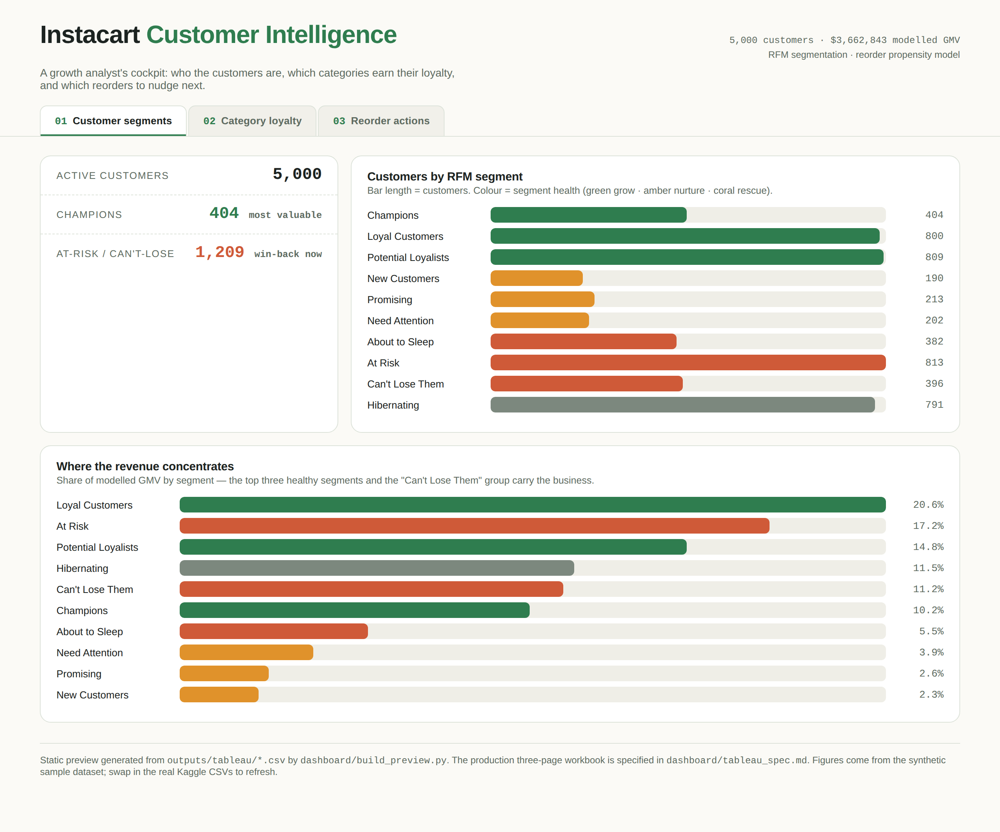
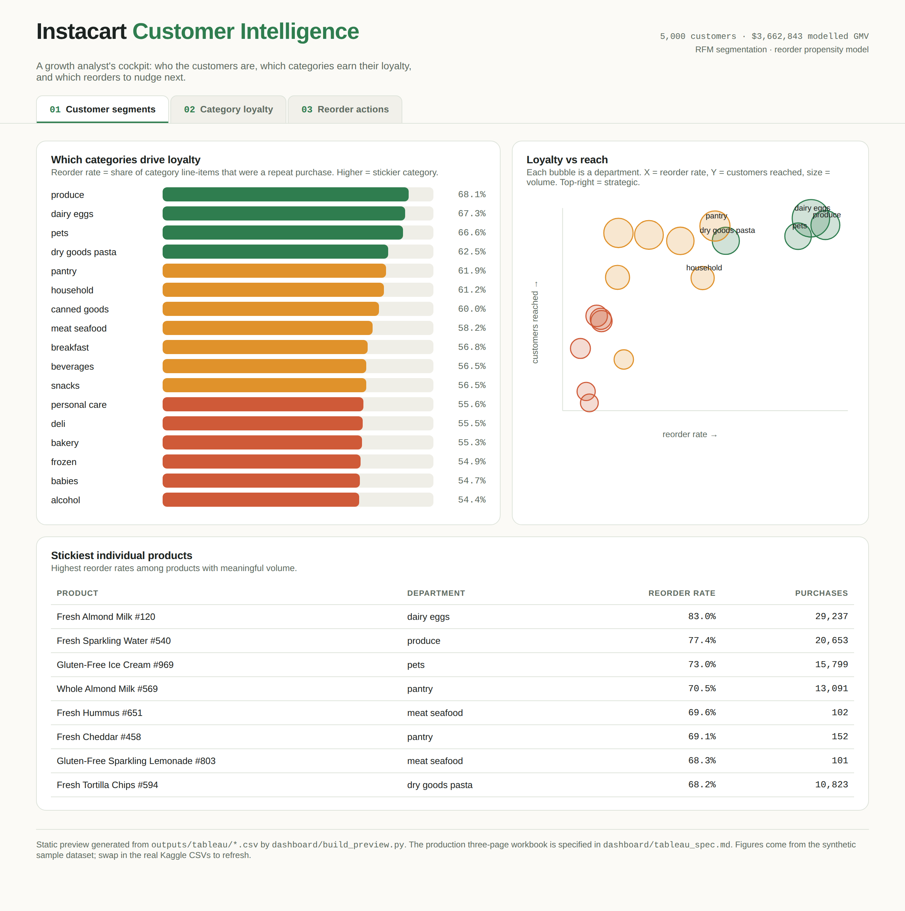
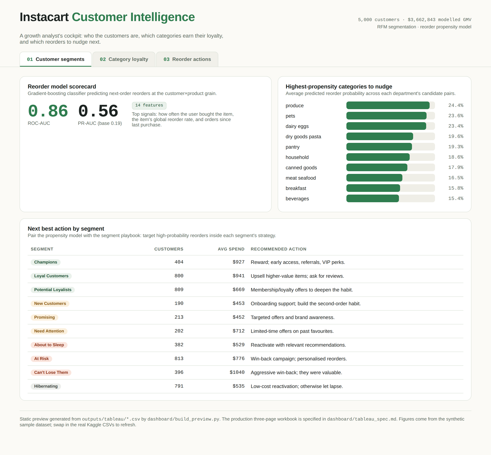

# 🛒 Cartographer — Customer Loyalty & Reorder Prediction
This project implements an end-to-end retail analytics system that maps grocery customers into loyalty segments and predicts what they will reorder next. Using Instacart-style transaction data, it loads everything into **PostgreSQL**, builds an **RFM segmentation**, trains a **reorder-prediction model** at the customer×product grain, and delivers a **three-page dashboard** of actionable insights — from raw CSVs to "who to nudge with which product."

## 🚀 Features
- **End-to-End Pipeline**: One command runs the whole flow — data generation, database load, cleaning, segmentation, modeling, and dashboard extracts.
- **RFM Customer Segmentation**: Scores every customer on Recency, Frequency, and Monetary value and sorts them into 10 canonical segments, each with a recommended marketing action.
- **Reorder Prediction Model**: A gradient-boosting classifier predicts whether a customer will repurchase a specific product, trained on 14 features engineered directly in SQL.
- **PostgreSQL Backend**: Real relational schema with bulk `COPY` loading, analytical views, and indexed joins — not just in-memory dataframes.
- **Runs With No Kaggle Login**: Ships a synthetic dataset in the *exact* Instacart CSV schema; drop in the real Kaggle files and rerun with zero code changes.
- **Reproducible**: Fixed random seeds throughout, plus an exactly-pinned `requirements.txt`.

## 🧠 Requirements
- Python 3.11+ (required by the pinned pandas 3.x)
- PostgreSQL 14+ running locally
- Installed Python packages:
  `pip install -r requirements.txt`
  (pandas, polars, pyarrow, SQLAlchemy, psycopg2-binary, python-dotenv, scikit-learn, matplotlib)

## ⚙️ How It Works
1. **Data Acquisition & Preprocessing**:
   - Generates 7 CSVs in the Instacart schema (5,000 customers, 1,000 products, ~60k orders) with a deliberately learnable reorder signal — or accepts the real Kaggle dataset dropped into `data/raw/`.
   - Loads everything into PostgreSQL, unions the *prior* and *train* order histories, and builds analytical views.
2. **Cleaning & Quality Control**:
   - Runs a **polars** data-quality report (nulls, duplicate keys, referential integrity, value-range sanity) and materializes a clean `orders_clean` table with basket size and order value.
3. **RFM Segmentation**:
   - Computes Recency (days since last order), Frequency (total orders), and Monetary (total spend), assigns 1–5 quintile scores, and maps the R–F grid onto 10 named segments + actions.
4. **Reorder Modeling**:
   - Frames the task at the `(user, product)` grain — candidates are pairs bought in prior orders; the target is whether the product appears in the held-out next order.
   - Trains and benchmarks Logistic Regression vs. a Histogram Gradient Boosting classifier, with fixed seeds for reproducibility.
5. **Delivery**:
   - Exports aggregated CSV extracts and renders a self-contained **three-page dashboard** (`preview.html`), specified for a production Tableau build in `dashboard/tableau_spec.md`.

## 📊 Results
*(synthetic sample — 5,000 customers, ~$3.66M modelled GMV)*

The reorder model is evaluated against a base reorder rate of **0.19**, so a PR-AUC of 0.56 is roughly **3× the no-skill baseline**. Top predictive signals: how often the customer previously bought the item, the item's global reorder rate, and how many orders since they last bought it.

| Model | ROC-AUC | PR-AUC | F1\@0.5 |
| :--- | :--- | :--- | :--- |
| Logistic Regression (balanced) | 0.849 | 0.527 | 0.551 |
| **Gradient Boosting (HistGBDT)** | **0.862** | **0.560** | 0.407 |

Category loyalty and revenue concentration surface the actionable story:

| Insight | Leaders |
| :--- | :--- |
| **Stickiest categories** (reorder rate) | produce 68.1% · dairy eggs 67.3% · pets 66.6% |
| **Highest reorder propensity** (model) | produce 24.5% · pets 23.6% · dairy eggs 23.4% |
| **Revenue concentration** (% of GMV) | Loyal Customers 20.6% · At Risk 17.2% · Potential Loyalists 14.8% |

The three-page dashboard ([`dashboard/preview.html`](dashboard/preview.html)) ties it together: *who* each customer is, *which* categories earn their loyalty, and *what* to nudge them with next.

| Page 1 — Segments | Page 2 — Category Loyalty | Page 3 — Reorder Actions |
| :---: | :---: | :---: |
|  |  |  |

## 📁 Project Structure
- `run_pipeline.py`: Orchestrator running all six stages (`generate → load → clean → rfm → model → export`).
- `config.py`: Paths, database config, and sample/model parameters.
- `sql/`: Schema (`01_schema.sql`) and analytical views (`02_analytics_views.sql`).
- `src/`: Pipeline modules — data generation, Postgres loader, polars cleaning, RFM segmentation, reorder model, and Tableau export.
- `dashboard/`: Tableau spec (`tableau_spec.md`), preview builder, and the self-contained `preview.html`.
- `data/raw/`: Input CSVs (generated, or real Kaggle data).
- `outputs/`: Tableau extracts, figures, the data-quality report, and model metrics.
- `requirements.txt`: Exactly-pinned Python dependencies.
- `README.md`: Project documentation and setup guide.

## ⚡ Quick Start
```bash
git clone <your-repo-url> && cd cartographer
python -m venv .venv && source .venv/bin/activate
pip install -r requirements.txt

# create the database (defaults: user/pass analytics, db instacart)
createuser analytics --pwprompt --superuser
createdb instacart -O analytics

# run everything
python run_pipeline.py            # synthetic data
python run_pipeline.py --no-generate   # use real Kaggle CSVs in data/raw/
```
Then open `dashboard/preview.html` to view the dashboard.

## ⚠️ Notes & Caveats
- **Synthetic by default**: All headline numbers come from a generated dataset built to demonstrate the pipeline — they are *not* real Instacart findings. Swap in the Kaggle CSVs for real results.
- **Modelled prices**: Instacart ships no prices, so RFM's Monetary axis uses a clearly-separated `product_prices` enrichment table. It's labelled as such so source data and modelling convenience never blur.
- **Recency definition**: With no timestamps in the data, Recency is defined as `days_since_prior_order` on each customer's most recent order.
- **Targeting responsibly**: RFM segmentation drives marketing decisions; applied to real customers, segment-based targeting should be reviewed for fairness and privacy implications.

## 📄 License
This project is intended for educational and portfolio purposes.
